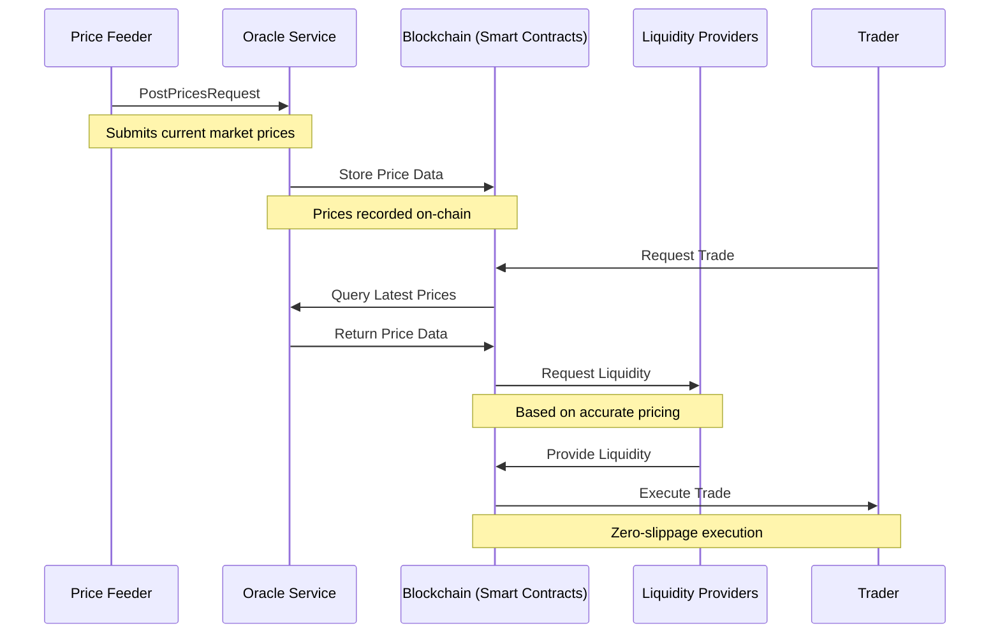
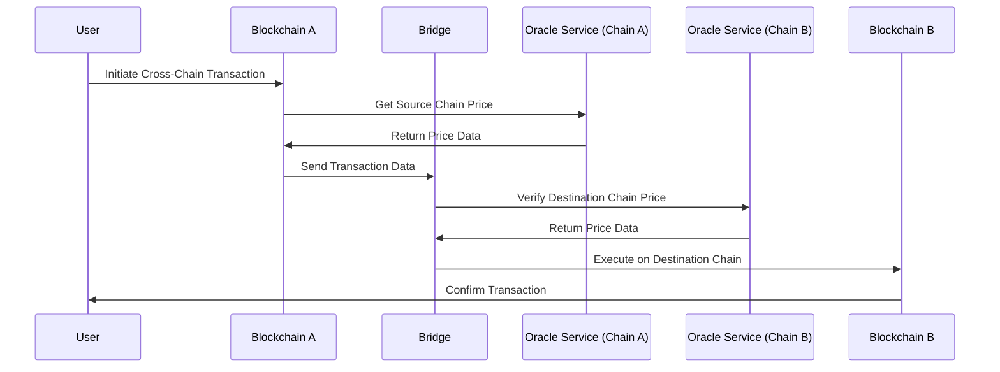
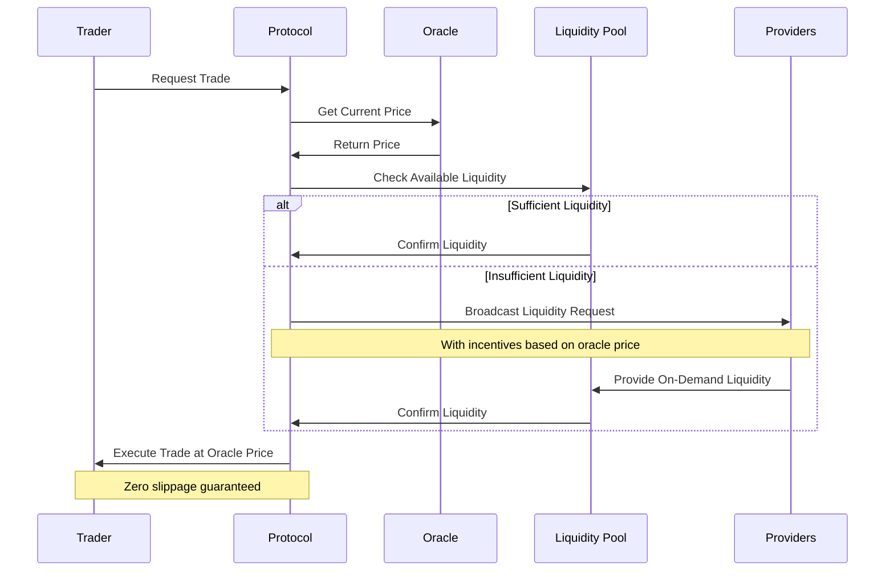

# Message Flow in Bolt Protocol

This document explains how messages flow through the Bolt Protocol system, showing how different components interact to enable zero-slippage trading, on-demand liquidity, and cross-chain compatibility.

## Oracle Service Flow

The Oracle Service provides price feed data to the Bolt Protocol. Here's how information flows through this service:

### Step-by-Step Explanation

1. **Price Data Collection**:
   - External price feeders collect market data from various sources
   - Price data is aggregated and formatted into `PriceUpdate` messages
   - A `PostPricesRequest` containing multiple `PriceUpdate` messages is sent to the Oracle Service

2. **Price Data Storage**:
   - The Oracle Service validates incoming price data
   - Valid price data is stored in the blockchain's state
   - This creates a reliable, tamper-proof record of price information

3. **Trade Execution**:
   - When a trader initiates a trade, the smart contract queries the latest price data
   - The Oracle Service returns the current price information
   - The smart contract uses this data to determine the fair execution price

4. **Liquidity Provision**:
   - Based on accurate pricing, the protocol requests liquidity from providers
   - Liquidity providers offer assets at the oracle-provided price
   - The trade executes with zero slippage, as price is determined before liquidity is committed

## Cross-Chain Operations

For cross-chain operations, the protocol extends this flow with bridge components:

### Cross-Chain Considerations

1. **Price Consistency**:
   - Oracle Services on different chains must maintain consistent pricing
   - The `InfoResponse` message helps identify which chain an Oracle is serving

2. **Bridge Security**:
   - Cross-chain messages must be securely verified before execution
   - Oracle data is used to ensure fair pricing across chains

3. **Latency Management**:
   - Cross-chain operations involve inherent latency
   - Oracle price validity periods must account for this latency

## On-Demand Liquidity Flow

The protocol enables on-demand liquidity through a combination of oracle pricing and liquidity provider incentives:

### On-Demand Liquidity Mechanism

1. **Liquidity Assessment**:
   - When a trade is requested, the protocol checks available liquidity
   - Oracle price data determines the execution price

2. **Liquidity Incentivization**:
   - If liquidity is insufficient, the protocol broadcasts a request to providers
   - Incentives are calculated based on oracle prices
   - Liquidity providers respond to these incentives by adding funds to the pool

3. **Guaranteed Execution**:
   - The trade executes at the oracle-provided price
   - This ensures zero slippage regardless of the liquidity depth

## Summary

The Bolt Protocol relies on accurate and timely price data from the Oracle Service to enable:

1. **Zero Slippage**: By establishing prices before liquidity commitment
2. **On-Demand Liquidity**: By incentivizing liquidity provision based on reliable pricing
3. **Cross-Chain Compatibility**: By maintaining consistent pricing across different blockchains

This message flow architecture ensures that all components work together to provide a seamless trading experience with Bolt's unique features. 